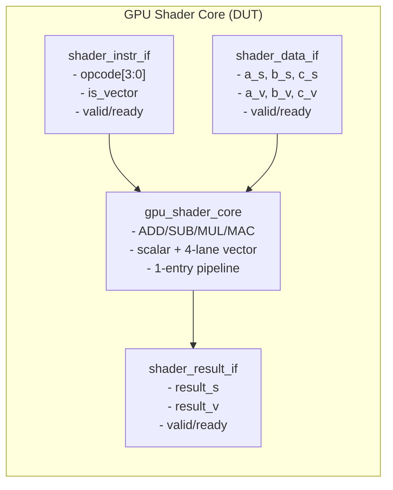
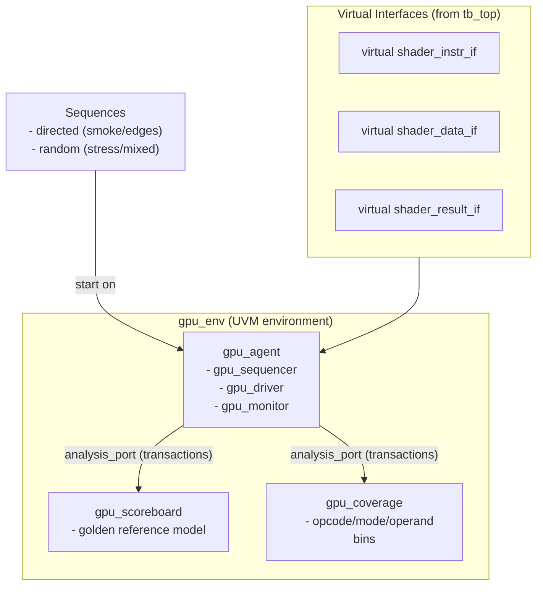
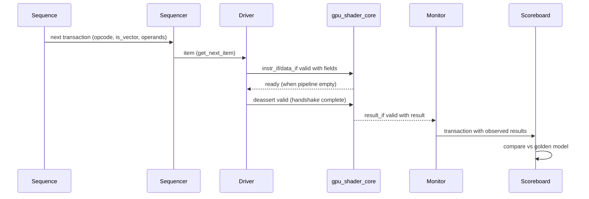

# Diagrams — GPU Shader Core and UVM Testbench

## GPU Shader Core (simplified)

Notes:
- Instruction and data requests use ready/valid; the core accepts when both are ready in the same cycle.
- `is_vector=0` selects scalar datapath; `is_vector=1` selects lane-wise vector operations.
- Results return with their own ready/valid handshake.

## UVM Testbench Components

Notes:
- Sequences create `gpu_seq_item` transactions; the driver turns them into interface handshakes.
- The monitor observes DUT outputs and publishes completed transactions to the scoreboard and coverage.
- The scoreboard compares against a golden model; coverage guides stimulus toward unhit scenarios.

## End-to-end in the testbench top

